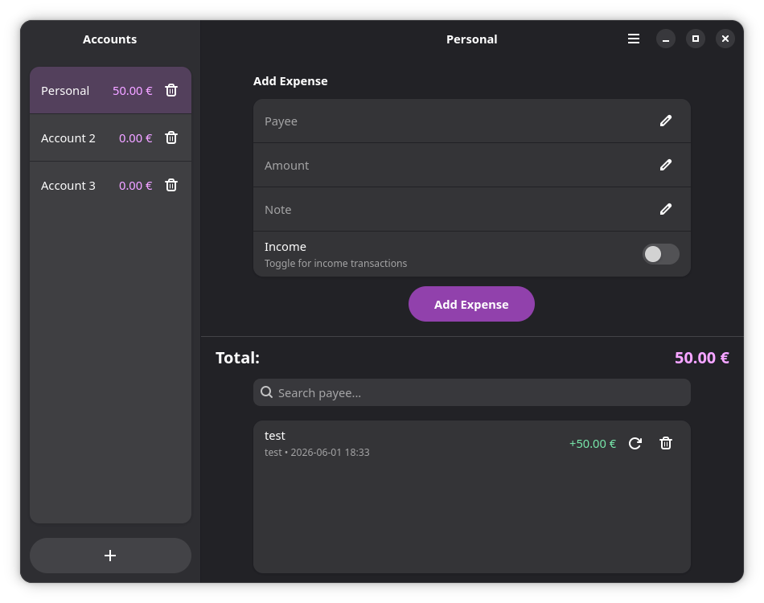
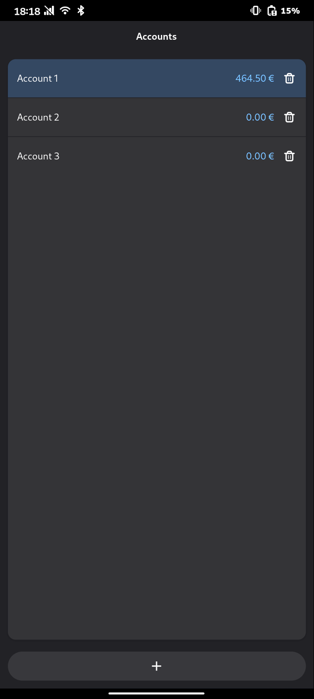
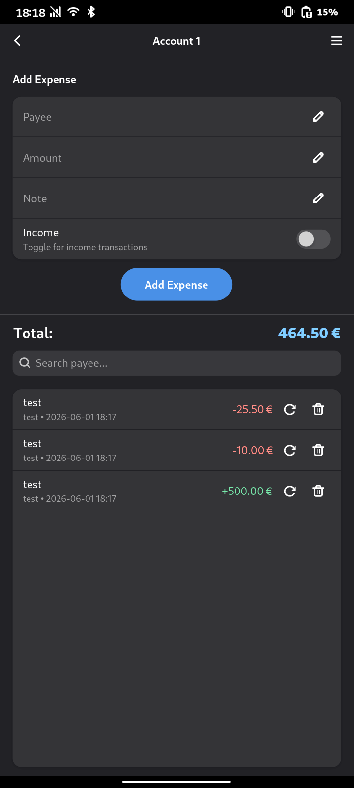
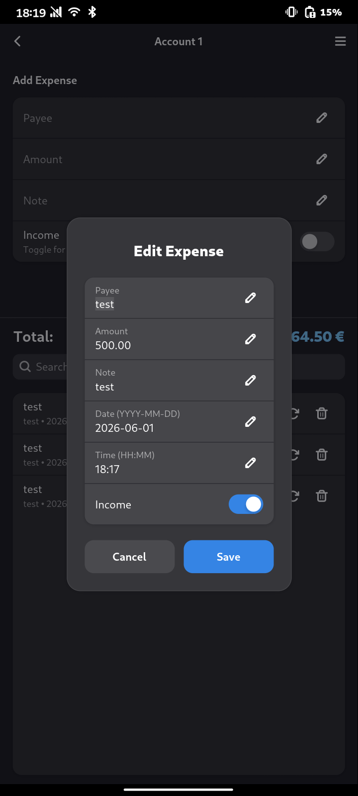
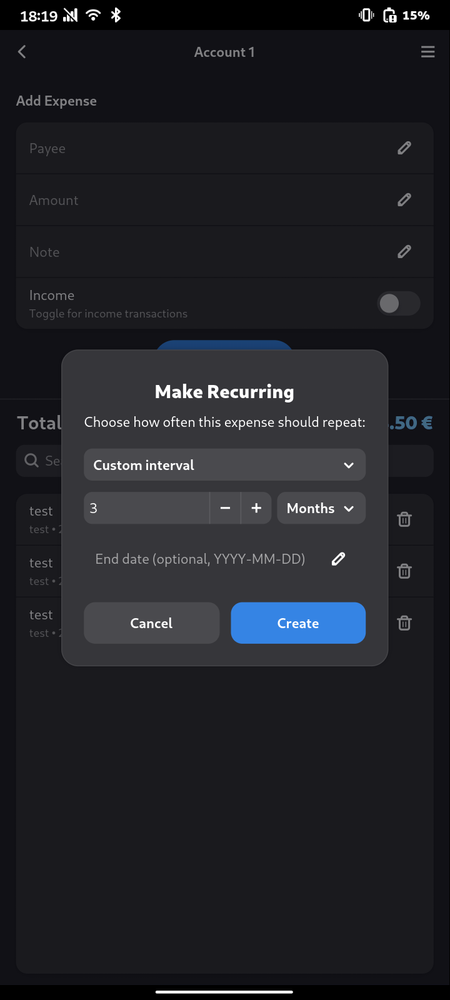

# Expenses

A (vibe coded) mobile-friendly expense tracker for Linux, written in Rust with GTK4 and Libadwaita.

This is a rewrite of the original Python version in Rust for better performance and lower resource usage on mobile Linux devices. I changed my mind on this again and decided to merge the content of the legacy repo in the python-legacy branch in this repo. Maybe not the cleanest solution but having to separate repos for more or less the same thing was not ideal in my opinion.

My motivation behind this one was that I like using the MyExpenses app from Michael Totschnig but having to boot the Android container all the time on my Linux phone was getting a little bit annoying. Therefore I decided to create this app with (a lot of) help from AI.

## Features

- Track expenses and income across multiple accounts
- Recurring expenses (daily, weekly, monthly, yearly)
- Search transactions by payee or note
- Import/export from the Android [MyExpenses](https://github.com/mtotschnig/MyExpenses) app (export might not work, havent tested it yet)
- Database backup and restore
- Adaptive UI for mobile and desktop

## Screenshots







## Building

The easiest way to build the app is by using GNOME Builder IDE or flatpak-builder.

Example using flatpak-builder as a flatpak:
-  Install flatpak-builder
```
flatpak install org.flatpak.Builder
```

-  Compile the project into a local repo
```
flatpak run org.flatpak.Builder --repo=repo --force-clean --user build io.github.nico359.expenses.json
```

-  Then create a bundle which you can install
```
flatpak build-bundle repo expenses.flatpak io.github.nico359.expenses
```

## License

GPL-3.0-or-later

## AI Disclosure

This application was built with the assistance of AI (GitHub Copilot CLI, Claude Haiku 4.5, Claude Opus 4.6).
